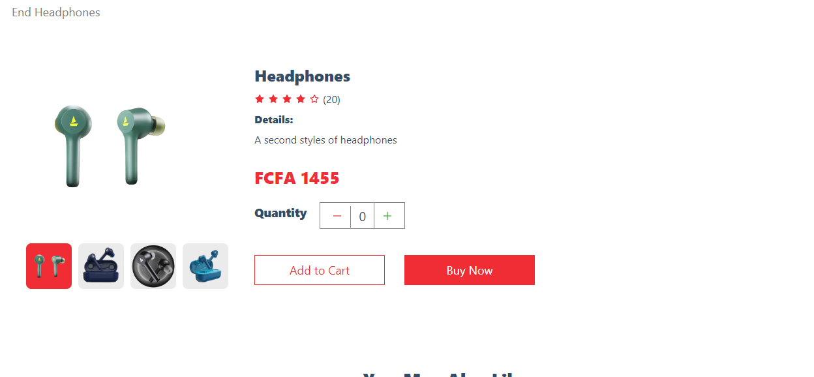

# E-Commerce App
This is a modern ecommerce application built with Next.js, React, and Sanity.io. It features a fully functional shopping cart, product pages, and more.


## Description

This is an e-commerce app built with [Sanity](https://www.sanity.io/) as the headless CMS and [React](https://reactjs.org/) as the frontend library plus [NextJS](https://nextjs.org/). It allows users to browse and purchase products online.

## Features

- User authentication and registration
- Product catalog with search and filtering options
- Product details page with images, descriptions, and pricing
- Shopping cart functionality
- Checkout process with payment integration using [Stripe](https://stripe.com/)
- Order history and tracking




## Installation

1. Clone the repository:

   ```bash
   git clone https://github.com/Nde-Dilan/e-commerce-app.git ```
 
2. Usage
To start the development server, run the following command:
   ```bash
   npm run dev ```   
   

Then, open http://localhost:3000 in your browser to see the app.      

## Project Structure

 Here's an overview of the project's structure:


- app/: Contains the global CSS file and layout components.
- components/: Contains reusable React components.
- ecommerce/: Contains configuration files for the ecommerce functionality.
- lib/: Contains utility functions and helpers.
- public/: Contains static files like images.
- Product Page

